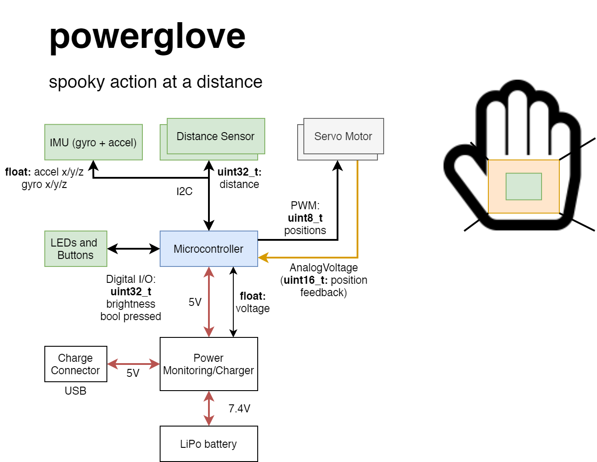

# Milestone 1

## Architecture Drawing

## Sensors

Ideally, the sensors are small, simple devices that can easily be integrated into the user's hand. 

* Distance/Proximity Sensor(s) - Time of Flight
    * VL53L0 - Time of Flight Distance Ranging Sensor: breakout boards are pretty flat, i2c interface with 1mm resolution, ~30mm-1m linear sensing
* Acceleration/Velocity Sensor - Simple 3/6DoF Velocity Sensing
    * NRF built in? 
    * 6DOF IMU - i.e. LSM6DS3, MPU6050
    * Provides essential secondary input signal for tracking hand motion

## Actuators

For actually generating the force, we plan to have some servos linked to a plate in the palm

* 2 or 3 micro servomotors mounted on the back of the hand that have position feedback outputs (e.g. [this](https://www.pololu.com/product/3436).)
* Some inspiration for the idea came from [this video on haptics](https://www.youtube.com/watch?v=UFgp7A1IK7o).

## Resources

We will use existing libraries for the distance sensor, found [here](https://www.st.com/en/embedded-software/stsw-img005.html). They may need slight porting for use with the NRF which we can do.

The IMU, if we use the one on the boards we have, already has libraries for it from lab.

Mechanical assembly: between the 2 of us exist:
* CNC mill
* 3D printer
* Various mechanical and electrical components

## Additional Circuits

* Portable Power: LiPo (7.4V) and charging/monitoring circuit
    * Detect low charge and enter low power mode or turn off

## Possible Risks

* The major risk is getting hardware (like the actual hand mount and actuators) up in a reasonable time. This takes CAD work, manufacturing, and multiple interations that can take time from software development and refinement of the "embedded system" as a whole.
* Haptic feedback not enough for appropriate user response, need testing of the human interaction early.